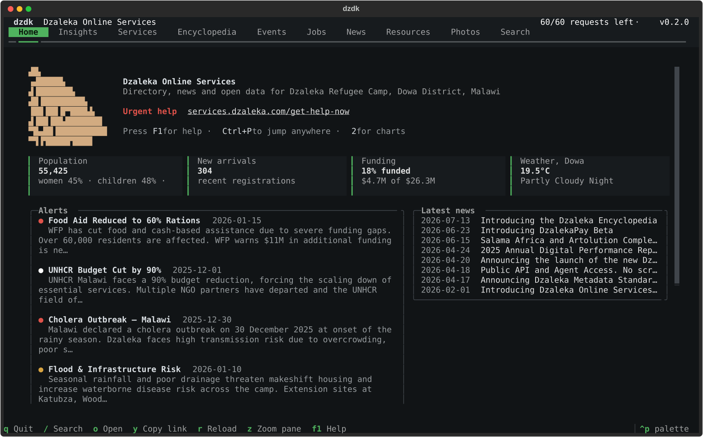
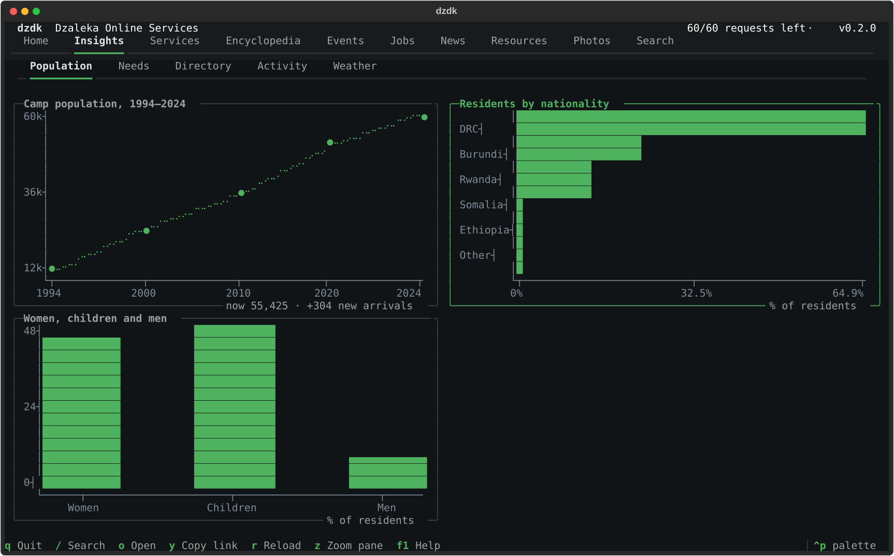
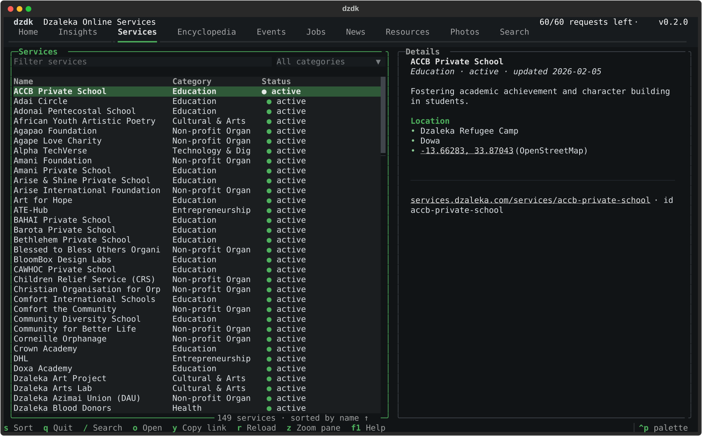
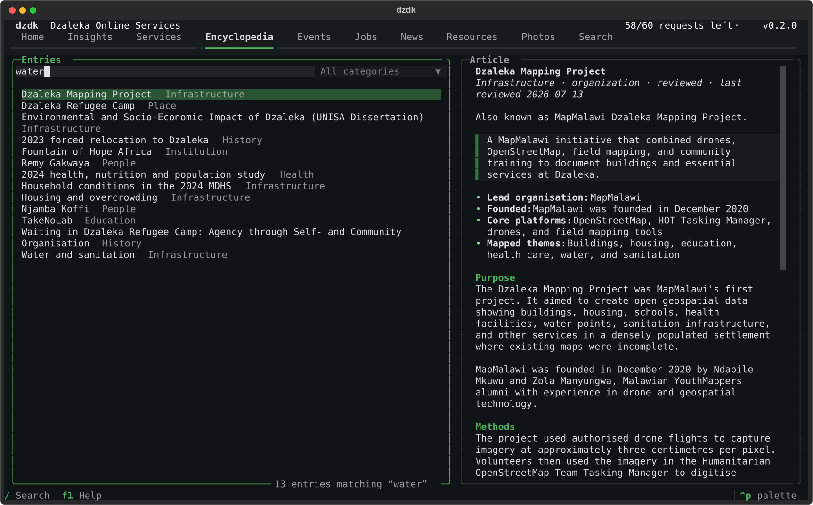

# dzdk

A terminal client for [Dzaleka Online Services](https://services.dzaleka.com): the
community directory, news and open-data site for Dzaleka Refugee Camp in Dowa District,
Malawi.

`dzdk` has two parts:

- **A full-screen app**: type `dzdk` and it opens, for browsing services, the Dzaleka Encyclopedia,
  events, jobs, news, resources and photos, with charts of population, needs, funding,
  activity and weather. Built with [Textual](https://textual.textualize.io) and
  [textual-plotext](https://github.com/Textualize/textual-plotext).
- **Commands** (`dzdk services list`, `dzdk search`, `dzdk chart`, `dzdk export csv`, and
  more) for quick lookups, scripts and data exports.

Both read the public, read-only [Dzaleka Online Services API](https://services.dzaleka.com/api-docs).
It needs no account or API key.



## Install

Requires Python 3.9 or later. To get a `dzdk` command that works in any terminal, install it
as a tool with [uv](https://docs.astral.sh/uv/) or [pipx](https://pipx.pypa.io/):

```bash
uv tool install dzdk        # or: pipx install dzdk
```

Then type `dzdk` to open the app.

Plain `pip install dzdk` also works inside a virtual environment.

To serve the app in a web browser as well as the terminal, install the `serve` extra:

```bash
pip install "dzdk[serve]"
```

From a clone of this repository:

```bash
git clone https://github.com/Dzaleka-Connect/dzdk-cli.git
cd dzdk-cli
python -m venv venv
source venv/bin/activate         # Windows: venv\Scripts\activate
pip install -e ".[dev]"
```

## The app

```bash
dzdk
```

At a terminal, `dzdk` on its own opens the full-screen app, the same as `dzdk tui`. When
its output is piped or used in a script, it prints an overview instead. `dzdk help` always
prints the overview.

The app is designed for a window of about 140×42 characters. If yours is smaller, `dzdk tui`
asks the terminal to grow the window (macOS Terminal, iTerm2 and xterm support this) and
restores the original size when you quit. The layout also adapts to whatever size it gets,
including when you resize the window while it runs:

- Below 110 columns, lists stack above their details, and the dashboard and charts use one
  column.
- On short windows, the header uses a smaller logo.
- `[` and `]` make the list pane narrower or wider. The width is saved.
- `z` zooms the focused pane, or a chart, to fill the window. Press it again to return.

```bash
dzdk tui --size 160x48       # grow to a different size
dzdk tui --no-resize         # never touch the window size
dzdk config --window-size off
```

| Tab | What it shows |
|---|---|
| Home | Population, new arrivals, funding and weather; current alerts; latest news; open jobs |
| Insights | Charts in five groups: Population, Needs, Directory, Activity, Weather |
| Services | All listed organisations, filterable by name and category, with contact details and location |
| Encyclopedia | Sourced reference entries with search as you type; related entries link to each other |
| Events, Jobs, News, Resources, Photos | Each collection as a sortable, filterable list with a detail pane |
| Search | One search across every collection, grouped by type |

### Insights

The Insights tab draws charts from the API's open data. They are grouped into sub-tabs, and
each group loads only when you open it.

| Group | Charts |
|---|---|
| Population | Camp population 1994–2024; residents by nationality; women, children and men |
| Needs | Challenge impact scores; service capacity against demand; UNHCR funding and gap; major incidents timeline |
| Directory | Services, encyclopedia entries and resources by category |
| Activity | News per month; events per month; jobs by type |
| Weather | Temperature and rainfall over the next hours (MET Malawi) |




The same charts print in an ordinary terminal with `dzdk chart` (see below).



### Keys

| Key | Action |
|---|---|
| `1`–`9`, `0` | Switch tab (press `Esc` first if the cursor is in a text box) |
| `/` | Jump to the filter or search box |
| `Esc` | Leave the text box and return to the list |
| `↑` `↓` | Move through the list; the detail pane follows |
| `Enter` | Open the selected result, or move into the details |
| `s` | Change the sort column (clicking a column header also works) |
| `z` | Zoom the focused pane or chart to fill the window; press again to restore |
| `[` `]` | Make the list pane narrower or wider |
| `Tab` | Move between panes; on Insights, between charts |
| `o` | Open the current item on services.dzaleka.com |
| `y` | Copy the current item's link |
| `r` | Reload, bypassing the cache |
| `Backspace` | Go back to the previous encyclopedia entry |
| `Ctrl+P` | Command palette: jump to any loaded item, tab or page by name |
| `F1` | Help |
| `q` | Quit |

The app ships with a dark and a light theme (`dzaleka` and `dzaleka-light`) and works with
every built-in Textual theme. Change it with **Ctrl+P → Change theme**. Your choice is saved.



To run the app in a browser, for example on a shared computer:

```bash
dzdk serve --port 8000
```

## Commands

Run `dzdk help` for an overview, or add `--help` to any command.

```bash
# Find things
dzdk search "legal aid"
dzdk search water --type encyclopedia --type resources
dzdk services list --search health
dzdk services list --category education --page 2
dzdk jobs list --status open --sort-by deadline
dzdk services get inua-advocacy
dzdk services open inua-advocacy          # opens the page in your browser

# The encyclopedia
dzdk wiki search water
dzdk wiki get dzaleka-refugee-camp
dzdk wiki list --category People

# Other collections: courses, artists, poets, marketplace and more
dzdk browse
dzdk browse poets

# Charts, printed in the terminal
dzdk chart --list
dzdk chart population-growth
dzdk chart --group Needs

# Live data
dzdk alerts
dzdk weather
dzdk population stats
dzdk stats overview

# Files and exports
dzdk resources fetch --id <id> --output report.pdf
dzdk export csv --type services --output services.csv
dzdk export all --output everything.json
```

Every list and detail command accepts `--json` for scripting:

```bash
dzdk jobs list --status open --json | jq '.[].title'
```

The full command reference is in [doc.md](doc.md).

## Working offline

API responses are cached in `~/.config/dzdk/cache` for five minutes by default. If the
network drops, `dzdk` shows the last cached copy and says so. Items you viewed recently stay
available on an unreliable connection.

```bash
dzdk config --cache-ttl 3600      # keep responses fresh for an hour
dzdk config --clear-cache
dzdk --no-cache services list     # always fetch fresh data
```

## For AI assistants

Dzaleka Online Services also runs a read-only
[MCP server](https://services.dzaleka.com/docs/agent-access-guide). `dzdk mcp` lists its tools
and prints the setup command, for example for Claude Code:

```bash
claude mcp add --transport http dzaleka https://services.dzaleka.com/.well-known/mcp
```

## Development

```bash
pip install -e ".[dev]"
pytest
uv tool install --editable . --force     # a global `dzdk` that runs your working copy
textual run --dev dzdk.tui.app:DzdkApp   # live CSS reloading while you edit dzdk/tui/dzdk.tcss
```

The code is split so that the command line and the app share everything except presentation:

| File | Contents |
|---|---|
| `dzdk/api.py` | HTTP client: rate limits, retries, error details, cache |
| `dzdk/catalog.py` | Collections and their columns, used by the commands and the app |
| `dzdk/insights.py` | Chart definitions, drawn by both the app and `dzdk chart` |
| `dzdk/render.py` | Detail views as Markdown, shared by the commands and the app |
| `dzdk/cli.py` | Click commands |
| `dzdk/tui/` | Textual app, widgets, charts, command palette, stylesheet and window sizing |
| `scripts/make_logo.py` | Regenerates the terminal logo from `docs/images/dzaleka-logo.png` |

On macOS, if your project is inside an iCloud-synced folder such as `Documents`, name the
virtual environment `venv` rather than `.venv`. iCloud marks files inside dot-folders as
hidden, and Python 3.13 ignores hidden `.pth` files, so an editable install stops working
with `ModuleNotFoundError: No module named 'dzdk'`.

Tests mock the API with [`responses`](https://github.com/getsentry/responses) and drive the
app with Textual's test pilot, so they run without network access.

## Data and licence

Content comes from Dzaleka Online Services and is published under
[CC BY-SA 4.0](https://creativecommons.org/licenses/by-sa/4.0/) unless a page says otherwise.
Attribute it to "Dzaleka Online Services" with a link to the source page. Photos and artworks
may carry separate rights, so check the credit on each one. Community listings can be
unverified; `dzdk` marks them.

The code is MIT licensed. See [LICENSE](LICENSE).

**Need urgent help?** Go to <https://services.dzaleka.com/get-help-now>.
